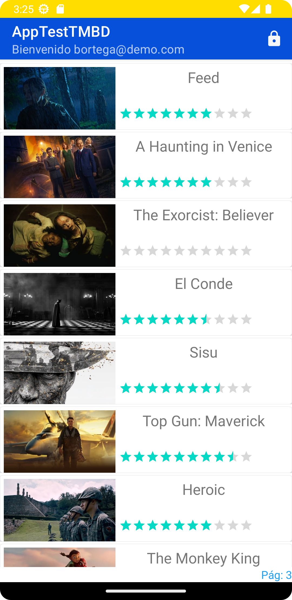

# AppTestTMBD
App test que consume el servicio themoviedb en Android Kotlin

<li>Inicio de sesión por medio de firebase 
<li>Listado de películas 
<li>Detalle de película y puntuación 
<li>Cierre de sesión 
 

